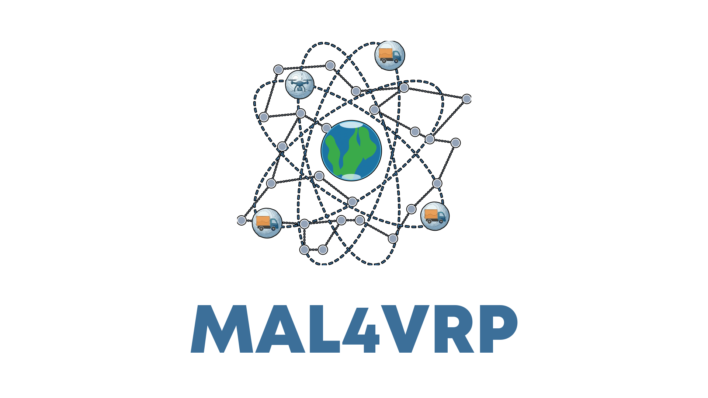

  

MAL4VRP is an open research community exploring the intersection of Machine Learning and combinatorial logistics. We develop Environments, Multi-Agent Learning algorithms, and benchmarks that leverage Neural Combinatorial Optimization to solve Vehicle Routing Problems (VRPs).

## Contributing

We welcome contributions from researchers, students, practitioners, and industry partners working on routing, logistics, machine learning, and optimization. Our goal is to foster collaboration between academia and industry to advance intelligent decision-making for real-world logistics applications.
